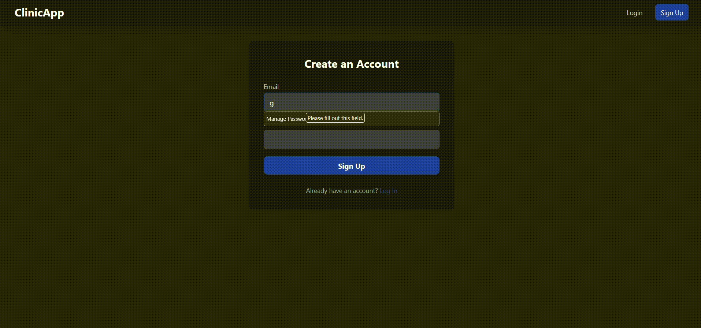

# Clinic Appointment System
A full-stack web application for booking and managing medical appointments, featuring a Django REST API backend and a responsive React frontend. This project was built as a demonstration of full-stack development skills.



## ✨ Features
User Authentication: Secure user registration and login using email and password.

JWT-Powered API: The backend API is secured using JSON Web Tokens (JWT) for stateless authentication.

Browse & Filter Doctors: Users can view a list of all available doctors and can search by name or filter by department.

Book Appointments: An intuitive form allows users to book an appointment with a specific doctor. The system includes validation to prevent booking appointments in the past.

Manage Appointments: Logged-in users can view a list of their own upcoming appointments and have the option to delete them with a confirmation step.

Responsive Design: The React frontend is fully responsive and provides a seamless experience on both desktop and mobile devices.

## 💻 Tech Stack
### Backend
Python

Django & Django REST Framework

Simple JWT (for tokens)

PostgreSQL / SQLite3

### Frontend
JavaScript

React (Vite)

React Router

Tailwind CSS

Axios

## 🚀 Getting Started
To get a local copy up and running, follow these simple steps.

### Prerequisites
Make sure you have the following installed on your machine:

Python (Python 3.13.3) & Pip

Node.js & npm

### Backend Setup
Clone the repository:

```Bash

git clone https://github.com/your-username/clinic-project.git
cd clinic-project/clinicbackend
```
Create and activate a virtual environment:

```Bash

# For macOS/Linux
python3 -m venv venv
source venv/bin/activate
```

# For Windows
```Bash
python -m venv venv
.\venv\Scripts\activate
```
Install Python dependencies:

```Bash

pip install -r requirements.txt
```
Set up the database:

```Bash

python manage.py migrate
```
Create a superuser to access the admin panel:

```Bash

python manage.py createsuperuser
```
Run the Django development server:

```Bash

python manage.py runserver
```
The backend API will be running at http://127.0.0.1:8000.

### Frontend Setup
Navigate to the frontend directory (in a new terminal window):

```Bash

cd clinic-project/clinicfrontend
```
Install Node.js dependencies:

```Bash

npm install
```

Run the React development server:

```Bash

npm run dev
```
The frontend application will be running at http://localhost:5173 (or another port if 5173 is in use).

## 📝 API Endpoints
The core API endpoints are structured as follows:

POST /users/signup: Creates a new user account.

POST /users/login: Authenticates a user and returns JWT tokens.

GET /users/me: Retrieves the profile of the logged-in user.

GET /doctors/: Returns a list of all doctors.

GET /doctors/<id>/: Returns details for a single doctor.

GET, POST /appointments/: Lists appointments for the logged-in user or creates a new one.

DELETE /appointments/<id>/delete/: Deletes a specific appointment.